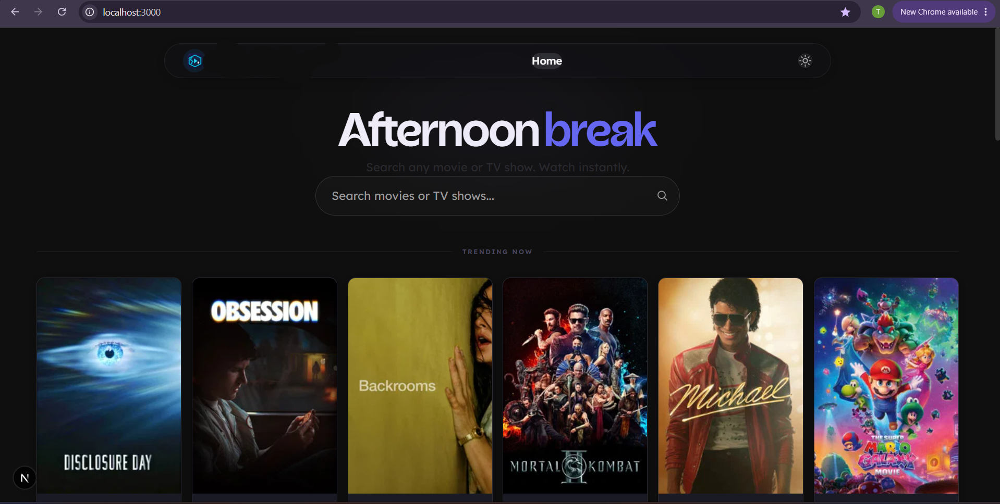
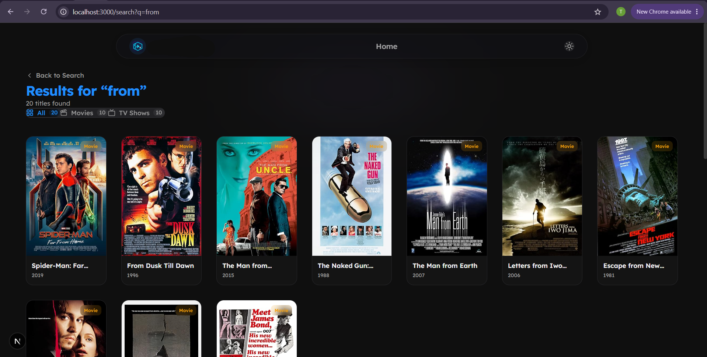
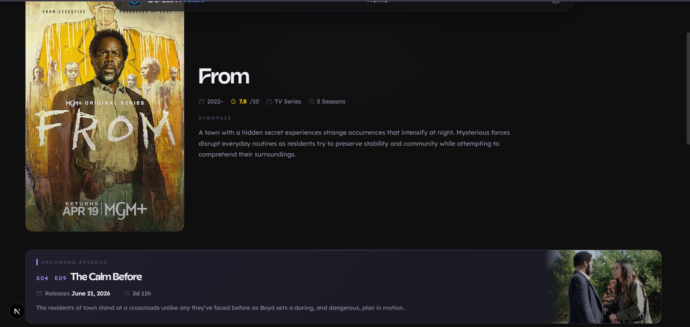
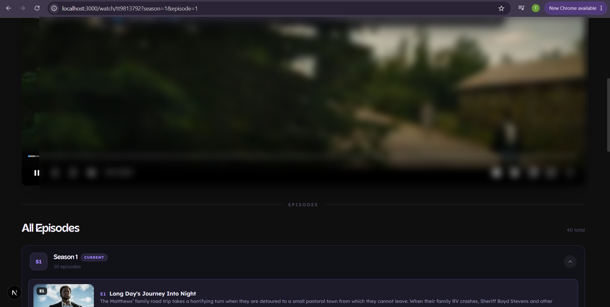
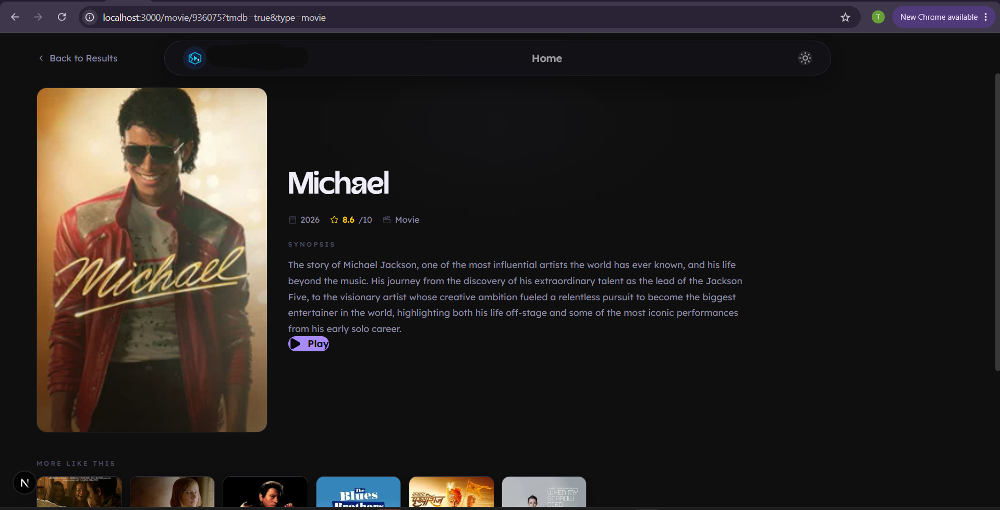
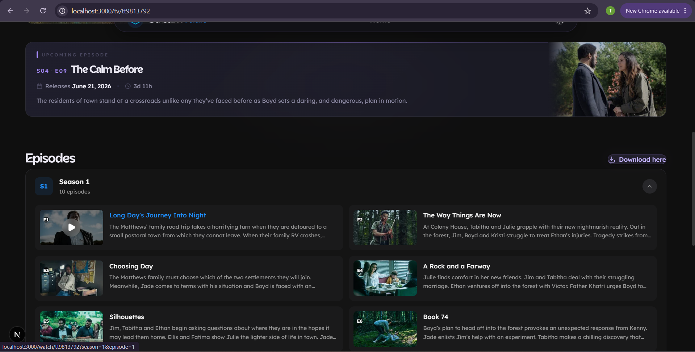

# StreamVault — Cinema‑Grade Streaming Discovery

A premium, cinematic streaming discovery platform built with Next.js, TMDB, and custom embedding logic. Designed for speed, elegance, and a truly immersive browsing experience.

---

## 📖 Overview

StreamVault is a full‑stack web application that allows users to search for movies and TV shows, browse trending content, and watch media through a clean, Apple‑TV‑inspired interface. The platform features dynamic routing, real‑time search, TV episode browsers, and a premium glass‑morphism UI with smooth animations.

Built as a personal project, it demonstrates advanced Next.js patterns, API proxying, client‑side state management, and responsive design.

---

---

## ⚙️ Tech Stack

| Layer | Technology |
|-------|------------|
| **Framework** | Next.js 16 (App Router) |
| **Styling** | Tailwind CSS + Custom CSS Variables |
| **Animations** | Framer Motion |
| **Icons** | Lucide React |
| **API Proxying** | Next.js API Routes + Middleware |
| **Data Fetching** | TMDB API, OMDb API |
| **Fonts** | Acorn (heading) + Lexend (body) |
| **Hosting** | Pxxl (production) |
| **State Management** | React Hooks (no external store) |

---

## ✨ Key Features

### 🎬 Search & Discovery
- Real‑time search with "Did you mean?" suggestions
- Search by movie or TV show with tabbed filtering
- Premium loading states with rotating messages
- Dynamic greeting based on user's local time (cinematic entrance)

### 📺 TV Show Browsing
- Season & episode browser with collapsible seasons
- Next episode countdown with air date tracking
- "Series Complete" banner for finished shows
- Episode thumbnails from TMDB
- "Watching" indicator for current episode

### 🎞 Movie Browsing
- Detailed movie pages with poster, synopsis, and rating
- "More Like This" recommendations (similar movies from TMDB)
- Play button with smooth transitions

### 🎨 Premium UI
- Glass‑morphism navbar (full‑width bar → pill on scroll)
- Cinematic ambient glow behind navbar
- Staggered word animations on hero greeting
- Smooth page transitions with Framer Motion
- Dark mode only (cinematic aesthetic)

### ⚡️ Performance
- 24‑hour caching for discovery data
- Rate‑limited API routes (50 requests per minute per IP)
- Origin/referer validation for API protection
- Server‑side rendering for static content
- Dynamic imports for heavy components

---

## 🧩 Component Highlights

| Component | Purpose |
|-----------|---------|
| `DynamicGreeting` | Time‑based hero greeting with animated accent word |
| `FilterableSection` | Language‑filtered content rows |
| `PosterRow` | Horizontal scrolling poster grid with hover effects |
| `SectionDivider` | Premium divider with centered label |
| `VideoPlayer` | Embed player with server switching (3 sources) |
| `TVEpisodes` | Season accordion + episode grid with thumbnails |
| `NextEpisodeCard` | Upcoming episode countdown |

---

## 🛡 Security Features

- API proxy hides OMDb and TMDB keys
- Rate limiting per IP (50 requests/minute)
- Origin/referer validation
- Middleware protection for all API routes
- Anti‑devtools protection

---

## 📸 Screenshots

| Homepage | Search Results | TV Show Page |
|----------|---------------|--------------|
|  |  |  | 

| Watch Page | Movie Page | Episode Browser |
|-----------|------------|-----------------|
|  |  |  |

---

## 🎥 Demo Video

[▶️ Watch Demo Video](Demo.webm)

---

## 📂 Project Structure

doc-whoknowsasaint.org/

· src/
  · app/
    · api/
      · discover/ – TMDB discovery endpoint
      · omdb/ – OMDb API proxy
      · tmdb/ – TMDB API proxy
    · movie/[id]/ – Movie detail page
    · search/ – Search results page
    · tv/[id]/ – TV show page
    · watch/[id]/ – Video player page
  · components/
    · DynamicGreeting.jsx – Time‑based hero greeting
    · FilterableSection.jsx – Language‑filtered content rows
    · Navbar.jsx – Glass‑morphism navigation
    · PosterRow.jsx – Horizontal poster grid
    · SectionDivider.jsx – Premium divider with label
    · TVEpisodes.jsx – Season accordion + episode grid
    · VideoPlayer.jsx – Embed player with server switching
  · lib/
    · omdb.js – OMDb API wrapper
    · tmdb.js – TMDB API wrapper
· public/fonts/
  · acorn-semibold.woff2 – Acorn font file
· env.local – Environment variables
· next.config.mjs – Next.js configuration
· tailwind.config.js – Tailwind CSS configuration
· package.json – Dependencies and scripts

---

## 🚀 Deployment

The app is deployed on **Pxxl** (production) and **Vercel**.

---

## 📚 Lessons Learned

- Next.js 15+ dynamic routing: `params` and `searchParams` are now Promises
- TMDB API integration: handling rate limits, fallbacks, and language filters
- Hydration errors: avoiding whitespace mismatches in `className`
- SSR fetch errors: using `NEXT_PUBLIC_APP_URL` for absolute URLs
- Premium UI design: glass‑morphism, ambient glow, staggered animations

---

## 📜 License

Private — All rights reserved.

---

## 🤝 Contact

- **GitHub:** [whoknowsasaint](https://github.com/whoknowsasaint)
---

---

Update your README with this, commit, and refresh — the images and video link should now work.
